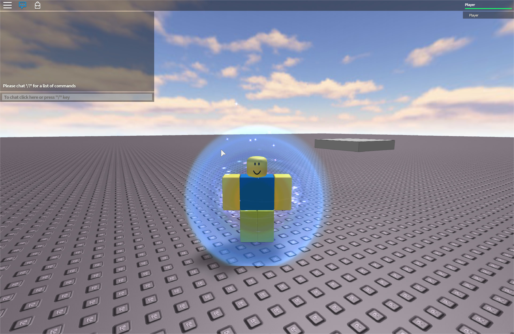
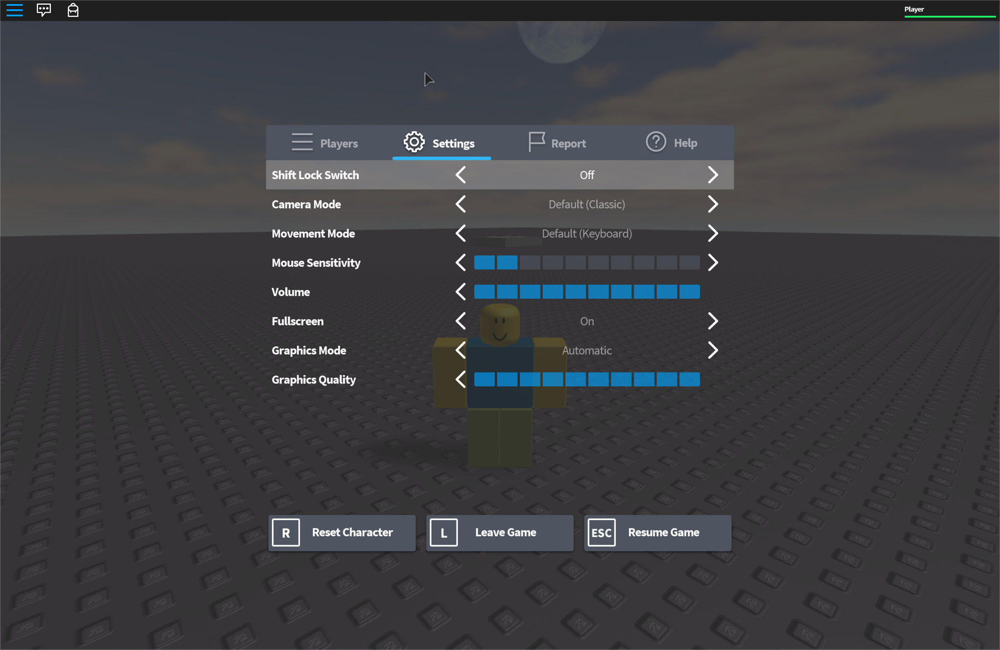
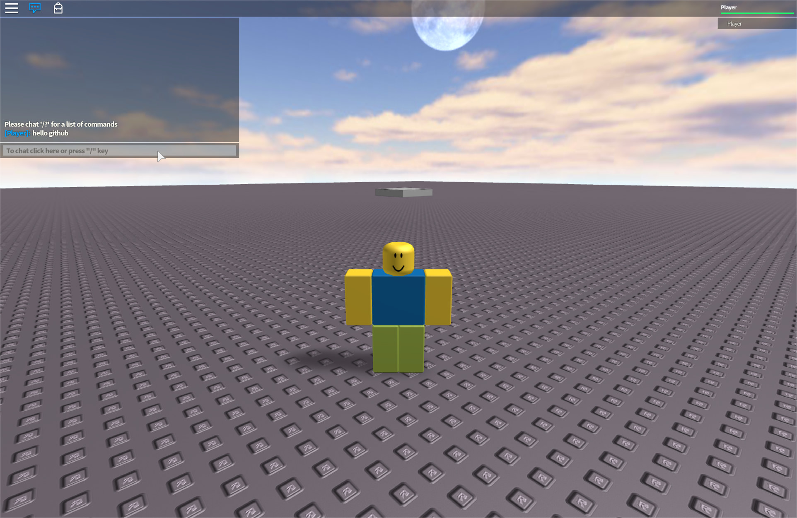

<p align="center">


</p>

# Roblox 2016 Apple Silicon Port

Native **ARM64** port of the 2016 Roblox client for Apple Silicon (macOS 11+).

This tree comes from the public 2016 source work ([P0L3NARUBA/roblox-2016-source-code](https://github.com/P0L3NARUBA/roblox-2016-source-code), lineage also via [kiemfp/Roblox](https://github.com/kiemfp/Roblox)). The goal here is simple: make **RobloxPlayer** run and play offline on M-series Macs. It is **not** modern Roblox (servers and protocol are dead).

**To build:** full Xcode, then see [Build](#-build) below (or `BUILDING.md` / `BUILDING_CONTRIBS.md` for deep contrib notes).

**Having problems?** open an [Issue](https://github.com/3ch0less/roblox-2016-arm64/issues).

**Want to play without joining anything?** use offline mode with `Baseplate-1.rbxl` under [Play (offline)](#-play-offline).

---

# Table of Contents

1. [Screenshots](#-screenshots)
2. [Features / Additions](#-features--additions)
3. [Status Checklist](#-status-checklist)
4. [Build](#-build)
5. [Play (offline)](#-play-offline)
6. [Controls](#-controls)
7. [Future](#-future)
8. [Known Limits](#-known-limits)
9. [Credits](#-credits)

---

## Screenshots

Offline spawn with classic forcefield (expires after a few seconds):



In-game settings (shift lock, camera, graphics, reset / leave):



Chat and player list on baseplate:



---

## Features / Additions

Work done on this Mac port (Phases 0 through 4, plus later offline polish):

- Native **arm64** `RobloxPlayer.app` via `MacClient.xcodeproj` (macOS 11+).
- **Offline boot** without ticket / join URL (`--offline`).
- **Local place load** from disk (`--rbxl` / `--placefile` + `file://` ContentProvider).
- **Visit Solo offline:** LocalPlayer, R6 character, RunService, game loaded.
- **GLSL shader packs** rebuilt and shipped (135 entries; sky / world paint).
- **Disk CoreScripts** compile on client (`canCompileScripts`); StarterScript, ControlScript, CameraScript path.
- **2016-style CoreGui path** offline (topbar / settings / chat modules from content).
- **Native WASD + jump + follow camera** fallback so play works even if Lua modules lag.
- **Local content preferred over dead CDN** (LegacyContentTable reverse map + offline extras).
- **Offline R6 keyframe animations** (walk / idle / jump / fall / climb / sit / tools / emotes under `content/animations/r6/`).
- **Spawn forcefield** expires after a few seconds (classic shield, not forever).
- Bundled `content/`, `shaders/`, `PlatformContent/pc` into the app Resources.
- Adhoc codesign (Sign to Run Locally); quiet debug probes (`RC_PROBE=1` optional).
- Public screenshots and offline play docs on GitHub.

---

## Status Checklist

What this fork can claim today vs still open.

### Done

- [x] Compile RobloxPlayer on macOS with Xcode (arm64)
- [x] Link and run without dyld / crash on boot
- [x] Offline window + engine init (no join server required)
- [x] Asset folder resolve to app `Resources/content/`
- [x] Real GLSL packs (not empty stub)
- [x] First paint (sky / lighting)
- [x] Load local `.rbxl` (`Baseplate-1.rbxl`)
- [x] LocalPlayer + R6 character spawn
- [x] Follow camera + camera-relative walk
- [x] Jump physics
- [x] RunService running offline
- [x] CoreScripts source compile from disk
- [x] StarterScript + default PlayerScripts load path
- [x] ControlScript / CameraScript rbxmx offline
- [x] Native WASD / Space fallback
- [x] Esc settings / chat UI path offline
- [x] Soft-fail missing CoreScripts (no hard abort)
- [x] FMOD null guard (silent if stub, no crash)
- [x] libLog install name fix (`@executable_path/../Frameworks/...`)
- [x] Offline CDN asset rewrite for shipped files
- [x] Offline R6 keyframe animate pack (no roblox.com)
- [x] Spawn forcefield duration / expire
- [x] Regression bar: `--offline --rbxl Baseplate-1.rbxl`

### Not done yet

- [ ] Real arm64 FMOD (audio still silent; arm64 dylib is a stub)
- [ ] Multiplayer / 2016 join protocol end-to-end
- [ ] Rocknet (or other revival) join from this Mac client
- [ ] RCCService on Mac
- [ ] Official Roblox live servers (impossible; protocol dead)
- [ ] Full avatar / catalog appearance offline
- [ ] RobloxStudio arm64
- [ ] Notarized / polished Release zip or dmg
- [ ] R15 offline verified as default path
- [ ] Android client

---

## Build

Requires full **Xcode** (not only Command Line Tools):

```bash
sudo xcode-select -s /Applications/Xcode.app
cd /path/to/this/repo

WARNFLAGS="-Wno-deprecated-declarations -Wno-deprecated-builtins -Wno-nonportable-include-path -Wno-deprecated-register -Wno-enum-enum-conversion -Wno-enum-float-conversion -Wno-error"

xcodebuild \
  -project MacClient.xcodeproj \
  -target RobloxPlayer \
  -configuration Debug \
  -arch arm64 \
  ONLY_ACTIVE_ARCH=YES \
  MACOSX_DEPLOYMENT_TARGET=11.0 \
  "OTHER_CFLAGS=${WARNFLAGS}" \
  "OTHER_CPLUSPLUSFLAGS=${WARNFLAGS}"
```

Product: `build/Debug/RobloxPlayer.app`

First builds are slow (Boost + large TUs). Prefer the `WARNFLAGS` `xcodebuild` line above over bare `build-arm64.sh` alone. See `BUILDING.md` / `BUILDING_CONTRIBS.md` for dependency rebuild notes.

---

## Play (offline)

**Never break this path** (regression bar):

```bash
./build/Debug/RobloxPlayer.app/Contents/MacOS/RobloxPlayer \
  --offline \
  --rbxl "$(pwd)/Baseplate-1.rbxl" \
  -ApplePersistenceIgnoreState YES
```

Optional debug probe:

```bash
export RC_PROBE=1
# writes /tmp/rc_probe.log
```

If macOS nags about reopening windows after a crash:

```bash
rm -rf ~/Library/Saved\ Application\ State/com.roblox.RobloxPlayer.savedState
```

---

## Controls

| Input | Action |
|-------|--------|
| **W A S D** | Walk (camera-relative) |
| **Space** | Jump |
| Mouse / wheel | Orbit / zoom |
| **Esc** | Settings / leave path (Esc x3 quits offline) |

---

## Future

Short list of what this port is aiming at next (not done):

1. **Audio** - real FMOD arm64 (or a CoreAudio shim) so walk / jump / UI are not silent  
2. **Join / multiplayer** - point the existing ticket + script URL path at Rocknet or another 2016-era host; first two-player baseplate  
3. **Ship** - clean Release `.app` zip on GitHub Releases so people can skip building  
4. **Polish** - keybinds (reset, chat focus), more places, tools offline  
5. **Studio arm64** - separate product; only after Player feel is solid  

Upstream Windows goals (full VS matrix, bootstrappers, Android) stay out of scope unless reopened.

---

## Known Limits

- Client cannot join modern Roblox; offline, local RCC, or a matching revival endpoint only.
- FMOD arm64 is a no-op stub; SoundService disables audio cleanly.
- CoreScriptConverter / some ShaderCompiler phases are stubbed on Mac; shaders ship prebuilt.
- Large Windows-only trees are gitignored (see `.gitignore`).
- Some HTTP content ids still fail against localhost (non-fatal fluff like rank icons).

---

## Credits

- 2016 source lineage: [P0L3NARUBA/roblox-2016-source-code](https://github.com/P0L3NARUBA/roblox-2016-source-code)
- Related fork: [kiemfp/Roblox](https://github.com/kiemfp/Roblox)
- Upstream private-server project for that era: [P0L3NARUBA/Rocknet](https://github.com/P0L3NARUBA/Rocknet)
- Contributors list from the source tree: [CONTRIBUTORS.md](CONTRIBUTORS.md)

This Mac arm64 Player work lives at [3ch0less/roblox-2016-arm64](https://github.com/3ch0less/roblox-2016-arm64).
